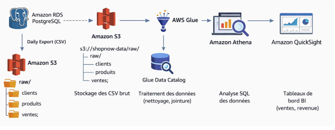
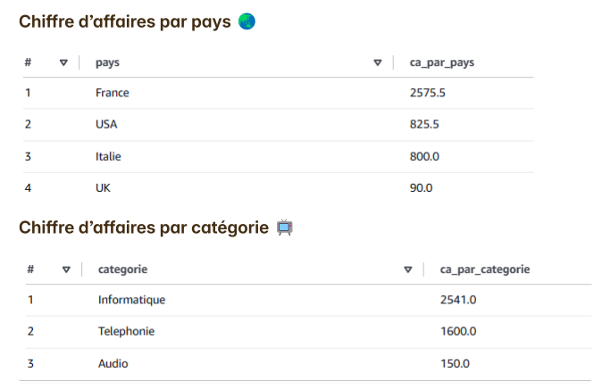

# ☁️ AWS Data Lake Architecture - ShopNow Project


##  Présentation du Projet
Conception et déploiement d'une architecture **Data Lake complète sur AWS** pour une entreprise E-commerce.
L'objectif était de centraliser les données transactionnelles (PostgreSQL) et de les préparer pour l'analyse, tout en respectant le principe de **moindre privilège**.

> **Méthodologie :** Déploiement via la Console AWS (Infrastructure as a Service).

---

##  Architecture Déployée



Le pipeline de données suit les étapes suivantes :
1.  **Source :** Base de données transactionnelle **Amazon RDS (PostgreSQL)** contenant les tables `clients`, `produits`, `ventes`.
2.  **Stockage (Data Lake) :**
    * `s3://shopnow-data/raw/` : Stockage des extractions brutes (CSV).
    * `s3://shopnow-data/analytics/` : Données nettoyées et optimisées via Glue.
3.  **ETL & Catalogue :** Utilisation d'**AWS Glue** (Crawlers & Jobs) pour cataloguer les données et transformer les types (casting, nettoyage).
4.  **Analyse :** Validation et exploration des données via **Amazon Athena** (SQL Serverless).

###  Zoom sur le Pipeline ETL (AWS Glue Studio)
J'ai conçu un workflow visuel pour joindre les tables `Ventes`, `Clients` et `Produits` et nettoyer les données avant l'export S3 :


---

##  Sécurité & Gouvernance (IAM)

Point central du projet : la mise en place d'une politique de sécurité stricte (RBAC - Role Based Access Control).
J'ai configuré **3 rôles IAM distincts** pour cloisonner les accès :

### 1. Rôle `Data Engineer`
* **Responsabilité :** Maintenance du pipeline et transformation.
* **Permissions :**
    * ✅ Lecture/Écriture sur tous les Buckets S3 (`raw` et `analytics`).
    * ✅ Accès complet à AWS Glue (Création de Jobs/Crawlers).
    * ✅ Accès à Athena.
    * ⚠️ Lecture seule sur RDS (Protection de la prod).

### 2. Rôle `Data Analyst`
* **Responsabilité :** Création de rapports et requêtes SQL.
* **Permissions :**
    * ✅ Accès à Amazon Athena pour requêter le Data Lake.
    * ⚠️ Lecture seule stricte sur S3 (`analytics/` uniquement).
    * ❌ **Interdiction** d'accès à la zone `raw/` ou aux jobs Glue.

---

##  Validation Technique & Résultats

Le pipeline ETL est fonctionnel et les données sont prêtes à être consommées.
Validation effectuée via des requêtes SQL complexes dans **Amazon Athena** :



*Exemple de requête analytique validée (CA par catégorie) :*

```sql
SELECT 
    p.categorie, 
    SUM(v.montant) as chiffre_affaires_total
FROM "shopnow_db"."ventes" v
JOIN "shopnow_db"."produits" p ON v.id_produit = p.id_produit
GROUP BY p.categorie
ORDER BY chiffre_affaires_total DESC;
```
## 🛠️ Services AWS Maîtrisés
* Amazon S3 : Partitionnement et cycle de vie des données (Raw vs Analytics).
* AWS Glue : Data Catalog, Crawlers et ETL Jobs (Visual).
* Amazon Athena : Création de tables externes et requêtes SQL d'analyse.
* IAM : Création de Stratégies et Rôles.

